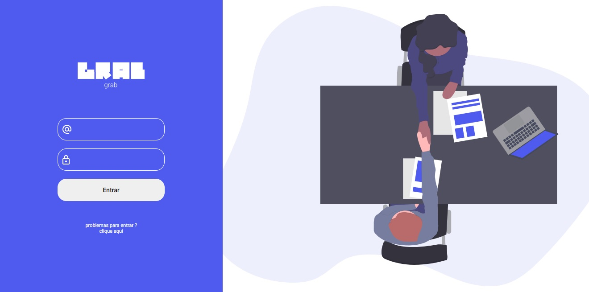
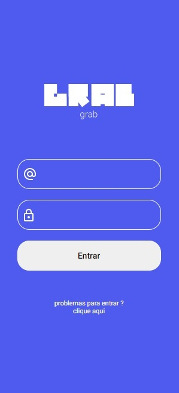
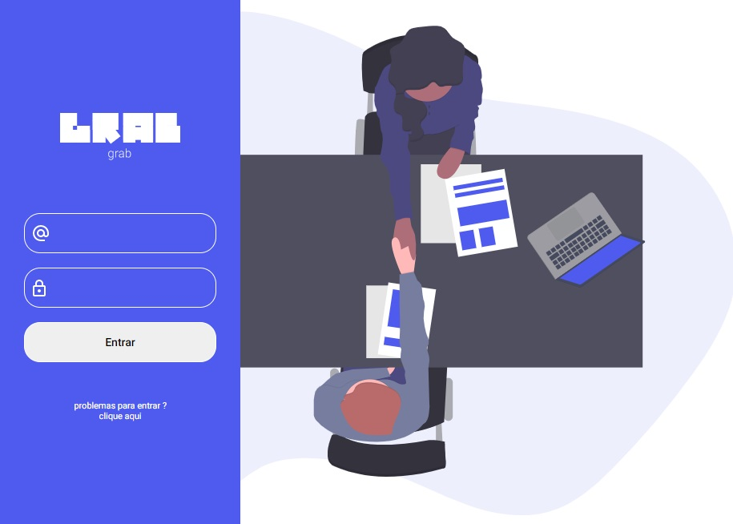

  
  <h3 align="center">Grab - Página de login</h3>

  <a href="https://github.com/magdielndantas/grab-pagina-de-login">Desafio</a> |
  <a href="https://www.linkedin.com/in/magdielndantas/">Contato</a>

# Grab
É uma interface básica de login, criada com o conceito de mobile first, a interface contém 3 layoults responsivos.

## Mobile first
A aplicação foi criada primeiramente para android e depois foi adaptada para pcs e tablets. Abaixo uma imagem do login para celular

 

## Visual para Tablets

 

# #Visual para desktops

 

### Fontes
[Roboto](https://fonts.google.com/specimen/Roboto)

## Icones
[Material Icons(outline)](https://material.io/resources/icons/?style=outline)

Desafio criado por [Magdiel Dantas](https://github.com/magdielndantas)

